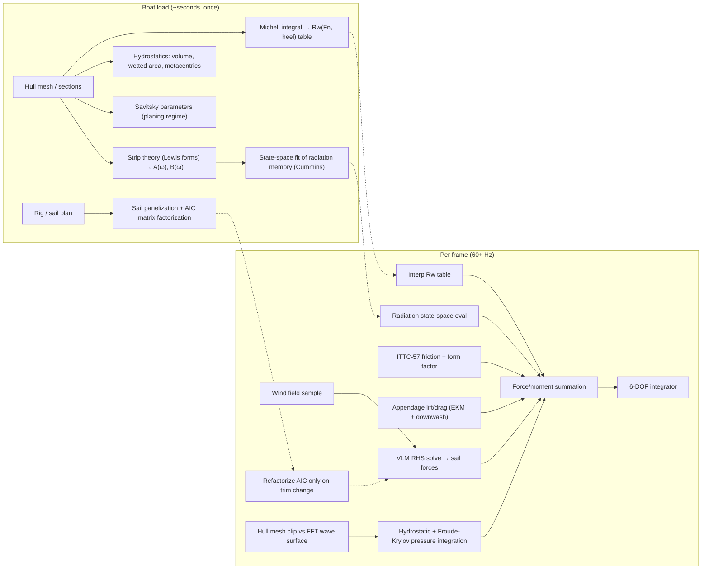

# Vela — Functional Analysis of the Physics Engine

Status: draft for discussion. Abstract level: no code, no crate layout beyond what the physics dictates.
Language: English (project convention). Discussion happens wherever it happens.
Companion: `engine-design.md` owns the interfaces (crate boundaries, boat data
format, force-module contract).

---

## 1. Goal and scope

A browser-based **physics simulator** (not an arcade game) of a sailing yacht:

- Forces computed live from first principles or experiment-derived regressions — no precomputed
  polar lookup as the primary model.
- Boats are **data files**: hull geometry, rig/sail plan, appendages, mass properties
  (mass, CoG, inertia tensor).
- Rigid body with 6 degrees of freedom, integrated in the time domain.
- Target: `wasm32-unknown-unknown`, 60 Hz render loop, single-threaded physics budget
  (wasm threads require COOP/COEP headers we cannot assume from static hosting).

In the academic taxonomy this is a **DVPP** — a *Dynamic Velocity Prediction Program*:
a time-domain 6-DOF simulation balancing aerodynamic and hydrodynamic force models,
as opposed to a classic steady-state VPP. First reported by Day et al. (2002); the
architecture below matches the "system-based approach" of modern DVPPs
[[Horel et al. 2020]](#bib-dvpp2020), which superpose independently-modeled force
components rather than solving the flow around the whole boat.

### Non-goals

- No runtime CFD. RANS/LES stays offline, as an optional source of override
  coefficients baked into boat files, and as a validation tool.
- No aeroelastic membrane FEM for sails at runtime (see §4.3 for the parametric
  substitute).
- No shallow-water effects in v1 (the TMA spectrum extension is noted in §6 as a
  future hook).

---

## 2. Architecture: two-stage pipeline

The core architectural decision: **"real-time" constrains per-frame cost, not
per-boat-load cost.** Generic hull handling is achieved by running cheap
potential-flow computations at load time (seconds), producing compact runtime
artifacts (tables, state-space models, fitted parameters) evaluated per frame
(microseconds).



Physics lives in a pure-Rust crate with **zero renderer dependencies**: testable
headless in native builds (regression suites, polar generation), with the
Bevy/wasm frontend as a replaceable consumer. This also insulates the physics
from Bevy's release churn.

A second consequence: the boat file stores **only geometry and mass properties**.
No baked coefficients required (though an override slot exists, §9). Anyone can
author a boat without running a preprocessing toolchain.

---

## 3. Rigid body and state

- Single rigid body, 6 DOF. State: position, orientation (unit quaternion),
  linear and angular velocity in body frame. Standard marine-craft kinematics
  and notation per Fossen [[Fossen 2011]](#bib-fossen).
- Force superposition (the DVPP "system-based" decomposition): aerodynamic
  (sails + windage), hydrostatic/Froude-Krylov, radiation, hull resistance,
  appendage lift/drag, damping corrections.
- Integrator: fixed-step **semi-implicit (symplectic) Euler or RK4**, hand-rolled.
  Adaptive-step ODE library solvers are the wrong shape for a real-time loop
  (variable cost per frame, no interpolation contract with rendering).
  Quaternion renormalization each step.
- Physics step decoupled from render rate: physics at fixed `dt` (e.g. 120 Hz
  substeps for stiff heel dynamics), render interpolates. The VLM may run at a
  lower cadence (10–20 Hz) with force interpolation — aerodynamic time scales
  are slow relative to the frame rate.

Added mass is **not optional**: for a hull in water the hydrodynamic added mass is
the same order as the boat's mass, and omitting it produces wrong accelerations in
every transient (tacks, gusts, waves). It enters through the strip-theory
coefficients (§5.3) as the constant infinite-frequency added mass matrix, with the
frequency-dependent remainder handled by the radiation memory term.

---

## 4. Aerodynamics

### 4.1 Sails — Vortex Lattice Method (upwind / attached-flow regime)

Live VLM over the sail plan, a few hundred panels:

- Horseshoe/ring vortices, no-penetration boundary condition → dense linear
  system `A·Γ = b`.
- **The AIC matrix `A` depends only on geometry.** Factorize (LU) only when the
  flying shape changes (trim input); per-frame work is a right-hand-side solve —
  O(N²), sub-millisecond at N ≈ 300.
- Output: lift distribution, induced drag, force and moment including heeling
  moment from the vertical distribution — the main advantage over sail-area
  coefficient models, which ignore planform and twist entirely.

VLM for sail plans in upwind conditions is well established
[[Ramolini 2009]](#bib-vlm-upwind); full-scale validation of VLM-based FSI
against instrumented boats shows inviscid methods hold up well while flow is
attached [[Augier et al. 2016]](#bib-inviscid). Real-time *unsteady* VLM
(deformable wake) is demonstrably feasible on current hardware
[[AIAA 2025]](#bib-uvlm-rt) — we keep the steady VLM with quasi-steady onset
flow as the baseline and treat UVLM as a possible upgrade, not a requirement.

Viscous corrections the VLM cannot see, applied on top: friction drag of the
sail surface (flat-plate estimate), mast and rigging parasite drag (windage),
per Larsson & Eliasson [[L&E]](#bib-le) and the IMS/ORC aero model lineage
[[Hazen 1980]](#bib-hazen), [[ORC VPP doc]](#bib-orc).

### 4.2 Separated-flow regime (downwind) — blended semi-empirical model

Potential flow dies at large effective angles of attack. Strategy:

- Per sail, estimate an effective angle of attack; beyond a stall threshold,
  **blend VLM output toward wind-tunnel-derived force coefficients**
  (smooth blending weight, no discontinuity in forces).
- Downwind coefficient sources: parametric spinnaker wind-tunnel series —
  camber ratio, aspect ratio, sweep systematically varied
  [[Lasher & Richards 2005]](#bib-spi); the Politecnico di Milano twisted-flow
  wind tunnel campaigns and the semi-empirical models built on them
  [[Fossati 2009]](#bib-fossati); cross-tunnel comparisons quantify the
  uncertainty band we inherit (~10–15% on lift)
  [[Campbell 2014]](#bib-tunnels).
- On a dead run the dominant parameter is projected area
  [[Lasher & Richards 2005]](#bib-spi) — the blended model degrades gracefully
  to bluff-body drag, which is the physically correct limit.

This is the honest state of the art short of RANS: every VPP in production use
does the same. Accuracy downwind is coefficient-limited, and we document that.

### 4.3 Flying shape — parametric, not FSI

Sail controls (halyard, cunningham, vang, sheet, traveler, backstay) do not act
on a rigid mesh; they act on the **flying shape**. Runtime membrane FEM (the
ARAVANTI-style FSI loop [[Augier et al. 2016]](#bib-inviscid)) is out of scope.
Instead:

- The sail is defined by a small set of shape parameters per section: camber,
  draft position, twist, entry/exit angles.
- Controls map to shape parameters through smooth empirical response functions
  (sail-trim literature and L&E give the qualitative derivatives; tuning against
  published flying-shape measurements [[Deparday et al. 2014]](#bib-deparday)).
- The VLM panels are regenerated from the parametric shape; AIC refactorization
  happens only on shape change (see §4.1).

This keeps controls physically meaningful (vang tension reduces twist → changes
vertical force distribution → changes heeling moment) at negligible runtime cost.

### 4.4 Wind model

- Mean wind: speed + direction, **vertical shear** (log/power profile) and the
  resulting apparent-wind twist over sail height — first-order effects on sail
  loading, cheap to compute.
- Gustiness: optional stochastic modulation (Ornstein-Uhlenbeck or filtered
  noise on speed/direction). Abstract requirement: temporally correlated, no
  white-noise steps.

---

## 5. Hydrodynamics — hull

Two models coexist by design (see §10 Validation): the DSYHS regression model
(phase 1 runtime, later demoted to test oracle) and the generic pipeline
(phase 3 runtime).

### 5.1 DSYHS regression model (phase 1)

Polynomial regressions from the Delft Systematic Yacht Hull Series (~70 hulls,
consistent tank campaign): residuary resistance, heel and induced-resistance
corrections. Primary source: Keuning & Katgert (2008), the latest bare-hull
formulation, extended to Fn ≈ 0.75 [[K&K 2008]](#bib-kk2008); foundation series
paper [[Gerritsma et al. 1981]](#bib-gerritsma); the textbook treatment with
worked coefficients in [[L&E]](#bib-le) and [[Fossati 2009]](#bib-fossati).
Accuracy within the parameter envelope: ~5% on upright resistance
[[K&K 2008]](#bib-kk2008).

**Load-time validation gate:** hull parameters (L/B, B/T, Cp, LCB, Fn range)
are checked against the DSYHS envelope; out-of-range hulls are refused by this
model (they route to the generic pipeline once it exists). Regression
polynomials extrapolate silently and catastrophically — refusing is a feature.

### 5.2 Generic resistance pipeline (phase 3)

Resistance decomposition, one method per physical component:

| Component | Method | Stage | Source |
|---|---|---|---|
| Friction | ITTC-57 line + form factor from wetted geometry | per frame (closed formula) | [[ITTC-57]](#bib-ittc) |
| Wave-making | Michell thin-ship integral → `Rw(Fn, heel)` table | load time | [[Michell 1898]](#bib-michell), [[Tuck 1989]](#bib-tuck) |
| Planing lift/drag | Savitsky method, blended in above Fn ≈ 0.6–0.8 | load time (params) | [[Savitsky 1964]](#bib-savitsky) |
| Heel/leeway induced | appendage model (§5.4) + hull side-force share | per frame | [[KKV 2006]](#bib-kkv) |

Michell caveats, acknowledged: accuracy degrades at low Fn (< 0.30) and for
beamy, non-slender hulls; modern viscous/nonlinear corrections exist and are
adoptable incrementally [[Improved Michell 2020]](#bib-michell2020), as is the
Neumann-Michell refinement [[Noblesse et al. 2013]](#bib-nm). The
displacement→planing transition band is the least accurate region of the whole
model — same limitation as commercial predictors
[[Savitsky review 2021]](#bib-savitsky-rev). We state this in user-facing docs
rather than pretending otherwise.

### 5.3 Seakeeping: added mass, radiation damping, memory

Frequency-domain coefficients from **strip theory** over 20–40 hull sections,
then time-domain via the **Cummins equation** [[Cummins 1962]](#bib-cummins),
[[Ogilvie 1964]](#bib-ogilvie): constant infinite-frequency added mass plus a
convolution over velocity history (fluid memory).

An earlier draft of this section called the sectional coefficients "closed-form"
once the Lewis mapping was in hand. That was wrong, and the correction is worth
keeping because it changed the size of the phase. The mapping is closed form; the
coefficients are not. Each section and frequency needs Ursell's multipole
expansion as extended by Tasai — a linear solve for the strengths of a standing
wave series, driven by a progressive wave system known analytically, followed by
a pressure integral. Two mapped sections that differ only in scale share no work.

The convolution is unsuitable for a real-time loop; standard practice replaces
it with a fitted low-order **state-space model** (2–4 states per significant
DOF), identified from the frequency-domain data — the Perez & Fossen FDI
methodology, with known guardrails on passivity and low-frequency asymptotics
[[Perez & Fossen 2008]](#bib-pf2008), [[Perez & Fossen 2009]](#bib-pf2009),
[[Taghipour et al. 2008]](#bib-taghipour). Runtime cost: a handful of
multiply-adds per DOF per step. The MSS toolbox is the reference implementation
to port the fitting algorithm from [[MSS]](#bib-mss).

Roll is special: strip-theory potential damping in roll is far too small;
viscous/eddy/appendage roll damping is added empirically (Ikeda-type components
or a calibrated quadratic damping term) — noted as a calibration point, not an
afterthought.

#### 5.3a Status: the sectional coefficients are built and verified

`vela_core::lewis` maps sections; `vela_core::tasai` solves the heave radiation
problem on the mapped section. Both are transcribed from Delft sources, since
the primary source of this engine puts added mass *"out of scope"*: the mapping
from [[Journée & Massie]](#bib-jm2001) §7.3, the multipole method from the
[[SEAWAY theoretical manual]](#bib-seaway) §4.1.1, which gives it in the form a
working program uses rather than as a derivation.

Four independent checks, because a transcription of five pages of indexed
equations deserves more than one:

1. **The source's own energy identity**, `M_0 A_0 - N_0 B_0 = π²/2`. It comes
   from equating two independent routes to the damping — the pressure integral
   and the energy the radiated waves carry off — so it involves every quantity
   in the method and holds at every frequency. This is the check that would have
   caught a slipped index, and it is reported at runtime, not just asserted in a
   test, because it doubles as the truncation diagnostic.
2. **The published figure.** Figure 4.12 of the manual plots these coefficients
   for a containership midship section whose offsets §3.4 prints. Shape, the
   location and depth of the added-mass minimum, and the damping peak all land
   within figure-reading tolerance.
3. **Dimensional scaling**: geometrically similar sections at equal reduced
   frequency give coefficients in the ratio of their areas. Independent of the
   source entirely.
4. **The closed form substituted for the source's series.** The manual avoids a
   slowly-convergent integral with a power series after [[Porter 1960]]; that
   integral is `-i e^w E_1(w)` in closed form, checked against direct quadrature
   of the integral as printed.

Two things the doing of it taught, neither of which was in the plan:

- **The accuracy knob is the multipole count, and the scale that governs it is
  the reduced frequency `ξ_b = ω²B/2g`, not `ω`.** The quadrature converges long
  before it matters. A yacht is unusually comfortable here: its sections are
  narrow, so the whole range of encounter frequencies that matters sits below
  `ξ_b ≈ 1.5`, where twelve multipoles hold the identity to parts in a million.
  The method's known weakness — short waves concentrating flow at the waterline,
  where a series about the origin converges slowly — is a ship problem, and is
  recorded in a test rather than hidden.
- **Evaluating `E_1` needs a criterion on `|w| + Re w`, not on `|w|`.** That
  quantity is the series' cancellation exponent, and it vanishes exactly on the
  branch cut. The arguments this method produces all have non-positive real part
  and approach the cut at every station's keel, which is precisely where the
  continued fraction — the usual choice for large arguments — stops converging.
  The obvious `|w|` cutoff routes the worst points to the worse method.

What remains for phase 4: sway and roll sections (§4.1.2, §4.1.3 of the same
source), the frequency sweep to `A(ω)`, `B(ω)` for the whole hull, the
state-space fit below, and the viscous roll damping noted next.

#### 5.3b Status: the hull-level coefficients, and what they say about a yacht

`vela_core::strip` integrates the sectional coefficients into hull heave and
pitch, following §2.5.1 of the same source: `X_h3 = ∫X'_h3 dx`, and
`X_h5 = -∫X'_h3 x dx`. Zero forward speed, which the source itself argues for on
practical grounds — *"for ships with moderate forward speed (`Fn ≤ 0.30`), the
ordinary method provides a better fit with experimental data"* — and which is
worth stating rather than assuming, because a yacht upwind sits right at that
edge and because the speed terms break the `A_35 = A_53` symmetry the tests pin.

Verified on invariants rather than on a stored answer: the parallel-axis
relation under a shift of origin, zero coupling for a hull symmetric about the
origin, positive-definiteness of the added-mass matrix (Cauchy-Schwarz, true for
any hull with positive sectional added mass), and the analytic moments of a
constant section — including the trapezoidal rule's exact error on the second
moment, so that nobody later mistakes `A_55` for having converged when it has
not.

**Two results about the boat rather than the method**, both surprises:

1. **A narrow section radiates over a much wider band than a ship's does.** The
   frequency that governs radiation is the reduced one, `ξ_b = ω²B/2g`, so a
   3.2 m section reaches a given `ξ_b` only at a far higher `ω`. Damping for the
   YD-41 peaks near 2.25 rad/s and is still four-fifths of its peak at 4 rad/s.
   A test written on ship intuition — "damping has vanished by 4 rad/s" — failed,
   correctly, and is now written in `ξ_b`.
2. **Heave added mass is several times the hull mass.** For the YD-41, 21.4 t
   against 6.2 t of boat: the effective mass in heave is 4.4 times the
   displacement. This is not an error, it is what a shallow wide canoe body does
   — a flat plate has finite added mass and vanishing volume — and it means the
   vertical dynamics of a yacht are dominated by the water, not the boat.

With the hydrostatic stiffness the engine already computes, those give the first
quantitative statement about how this hull will actually move: heave natural
period 2.0 s at a damping ratio of 0.33. Both are where a 12 m yacht's should
be, which is the strongest evidence so far that the chain from offsets to
coefficients is right end to end.

`vela-cli radiation` sweeps frequency and closes with that heave mode, solved at
its own frequency by iteration, since the added mass sets the frequency that
sets the added mass.

#### 5.3c Status: the memory, moved into the time domain

`vela_core::cummins` closes the phase. `A_∞` belongs in the mass matrix; the
frequency-dependence becomes a low-order linear system whose impulse response is
the retardation function, fitted from `K̂(jω) = B(ω) + jω[A(ω) - A_∞]` by
iteratively reweighted least squares (Sanathanan-Koerner), realised in
controllable canonical form and stepped by the exact matrix exponential rather
than a Runge-Kutta scheme — the fitted poles span more than a decade in time
constant, and an explicit scheme on the fastest would set the step for the whole
simulation.

On the YD-41: `A_∞` = 26.6 t, and order 4 reproduces the memory function to 2.3 %
with its slowest pole at 5.4 s, order 5 to 0.29 %. Passivity is exact — no
frequency at which the fitted water would drive the boat.

**The verification that matters** is a forced-oscillation test: the model is
driven at a single frequency in the time domain, its force correlated against the
drive to recover `Re K̂` and `Im K̂`, and those compared with the damping and added
mass the sectional solve produced in the frequency domain. Agreement is within
0.5 % across the band, and everything is in that path — transform, `A_∞`, fit,
realisation, stepper.

A free-decay test was tried first and is a worse instrument: with a damping ratio
near a third there are only two clean peaks before the amplitude falls into the
fit's slow residual mode, and extracting a damping ratio from two peaks needs the
damped period, the added mass at the frequency that period implies, and a
linear-damping formula that is itself approximate when added mass varies this fast
with frequency. Three approximations to test one thing. It survives as a
sign-of-the-force check, which is what it is genuinely good for.

**A diagnostic that had to be redesigned.** `A_∞` was first checked by the spread
of its per-frequency estimates, and that number was tuned by lengthening the time
horizon. It was the wrong number. The spread is dominated by whichever estimate
sits at the edge of the band: it moved by a factor of three between a 30 s and a
240 s horizon while the value moved in the fifth digit, and the two directions
disagreed — a longer horizon improved a hull and *degraded* a section, because
past the point where the frequency grid resolves the memory there is nothing left
to integrate but ringing.

What replaced it is a second, independent estimator. Integrating Ogilvie's
relation by parts gives `A(ω) = A_∞ - K(0)/ω² + O(ω⁻⁴)`, and `K(0) = (2/π)∫B dω`
needs no time grid at all. The two routes share the spectrum and nothing else —
not the transform, not the horizon, not the trapezoid over it — and they agree to
0.32 % on the YD-41. That is a statement about the pipeline; the spread was a
statement about the estimator.

The whole pipeline, sweep included, is 0.34 s for the YD-41 and is paid once at
load. Per step the simulation evaluates a four-by-four matrix-vector product.

#### 5.3d Viscous roll damping: Ikeda does not apply to this hull

The plan named Ikeda's semi-empirical method as the source for the viscous roll
damping that potential theory misses. It was read, measured against what the
engine already has, and **not implemented**. The reasons are specific.

Ikeda decomposes the viscous coefficient into five components. Taken one at a
time, for a sailing yacht:

- **Bilge keels** (`B44K`): a yacht has none. Not applicable.
- **Forward-speed correction on potential roll damping** (`B44S`): multiplies a
  potential roll damping this engine does not yet compute — the roll sections are
  not written. Nothing to correct.
- **Friction** (`B44F`): computed for the YD-41 rather than assumed. Kato's
  formulation gives `S_f = L(1.7 D + C_B B) = 23.2 m²`, which agrees with the
  22.3 m² the mesh integration reports — a good sign the transcription is right.
  With `r_f = 0.78 m` the quadratic coefficient is about 90 kg·m², so at a roll
  rate of 0.2 rad/s the moment is **3.6 N·m against the 700 N·m the appendage
  model already produces**. Half a per cent. Implementing it would be adding a
  term below the noise of the terms around it.
- **Lift** (`B44L`): the hull's own lift-based damping. For a yacht this is the
  small brother of the appendages' — keel span 1.9 m against 0.40 m of canoe
  draft — and the appendage version is already in place and tested.
- **Eddy making** (`B44E`): the one component that would matter, since the source
  notes it *"decreases rapidly with the forward speed"* and low speed is where the
  present model is weakest. It is also the one that cannot be transcribed.

**Why the eddy term cannot be transcribed.** It needs an angle

```text
ψ₂ = 0.5 / cos( a₁(1 + a₃) / 4a₃ )        as printed
```

which is not an angle, and oscillates without meaning as `a₃ → 0`. The physical
reading is `0.5 · arccos(·)` — the source's typesetting having lost the inverse.
But with `arccos` the argument must lie in `[-1, 1]`, and it does not: evaluated
on the seventeen stations of the YD-41 it ranges from **1.8 to 11.3**, every one
out of range. The argument goes as `a₁/4a₃`, and a shallow wide section has `a₃`
small and *positive* (0.018 to 0.041 here).

That is not bad luck, it is the envelope. The containership section of §3.4 has
`a₃ = -0.1136` and gives an argument of `-0.295` — comfortably in range. So the
method's domain is ship sections, exactly as the source warns when it says it *"is
not always accurate sufficiently"* for *"ships with a very large breadth to draft
ratio"*. The YD-41 canoe body is `B/D = 7.9`.

Two readings, both unusable, no oracle to choose between them, and a hull outside
the envelope either way. Writing it would produce the first unverifiable number in
this engine.

**What would unblock it**: Ikeda, Himeno & Tanaka (1978) in the original, which
would settle the expression and state the clamp; or any implementation with
tabulated output to check against.

**What the real roll gap is**, now that this has been measured: not the hull but
the appendages at high incidence. At rest the appendage model still produces
lift at an effective angle of attack near 90°, and its damping there is
quadratic in roll rate — the right *shape* — but roughly eight times a
flat-plate estimate. That is the term worth fixing, and it needs a source for
the limiting behaviour rather than an invented stall angle.

#### 5.3e Status: wired in

`assembly::vertical_motion_sim` builds the whole chain from a boat file: sections,
sweep, transform, fit, `A_∞` into the mass matrix via
`RigidBody::add_added_mass`, and the memory as a force module. Heave and pitch
free, everything else restrained and no sails — a deliberately narrow rig,
because the vertical modes are the only ones whose radiation this engine can
compute, and a general assembly would be quietly missing terms in four degrees
of freedom.

**A pushed hull now settles.** Six seconds after a 0.1 m displacement the YD-41
is within 2 cm of its waterline, and the logarithmic decrement over the first
cycle puts the damping ratio in the band the frequency domain predicted. Before
this, hydrostatic stiffness was conservative and nothing in the vertical modes
removed energy at all.

Two things the integration test caught that the unit tests could not: the boat
has to be allowed to find its own flotation before being perturbed — measuring
against the origin measures sinkage, which made a 0.1 m push look like 0.4 m of
leftover motion — and this mode is damped hard enough that only one clean peak
follows the release, so the release point itself has to serve as the first.

What remains for the phase: sway and roll sections for the other modes.

### 5.3f Balance: closing the data gap that restrains yaw

Yaw has been restrained since the beginning, and not because the physics is
missing. Every force this engine computes acts at a point, and for the sails and
the appendages the *longitudinal* part of that point is not in the data: the
source's published particulars give the sail plan's dimensions and the keel's
planform but never where either sits along the hull. The arm is missing, not the
force.

`vela_core::balance` closes that the way the source does, because Chapter 9 is a
design chapter and its rules are computable:

- **Centre of lateral resistance**, Fig 9.2: the extended keel only — *"for most
  fin-keel yachts the effect of the rudder and the forebody cancel each other
  reasonably well"* — with the centre at 45 % of the draft along the
  quarter-chord line. Since that line *is* the sweep line, the construction
  reduces to walking down it, which also means the sweep convention here cannot
  drift from the one the lift model uses.
- **Centre of effort**, Fig 9.3: the area-weighted mean of the fore and main
  triangle centroids. For the YD-41 this lands 0.194 m **aft** of the mast,
  because the mainsail is the bigger triangle — counter-intuitive, and a sign
  error there would move the mast by twice the offset.
- **Lead**, from the *Lead* section: 5–9 % of waterline for masthead sloops on a
  fin keel, 2–6 % for fractional.

**The oracle is unusually good here.** The source publishes the answer for its
own boat: *"The lead for the YD-41 is 2.2 %."* And the two statements corroborate
each other — `I/EHM` is 0.87, so the rig classifies as fractional, and 2.2 %
falls inside the fractional band and outside the masthead one. If the
classification were wrong the source would appear to contradict itself, which is
a check worth having.

With that, 2.2 % of an 11.90 m waterline is 0.262 m of lead, the centre of effort
is 0.194 m aft of the mast, and the mast therefore stands **0.456 m forward of
the centre of lateral resistance**. Everything about the rig's longitudinal
position follows from that plus the keel's own.

**What is still required rather than derived**: the keel's longitudinal position.
It is a design decision and no rule in the book produces it, so it is an input
(`vela-cli balance --keel-at`) and not a default dressed up as a derivation. The
two directions — place the mast for a lead, measure the lead of a placed mast —
are tested as inverses, because one fills a boat file in and the other checks it,
and if they disagreed a file could pass its own check and still be wrong.

Freeing yaw is what turns this from a design calculation into helm feel, and the
next section is that step.

#### 5.3g Status: yaw is free, and the boat carries a helm

The boat file gained a `layout` block — keel, rudder and mast, forward from the
aft perpendicular — and with it every lateral force gained an arm. Yaw is no
longer restrained for a boat that declares one; one that does not keeps the old
behaviour, because a force with no arm makes no yawing moment and restraining a
degree of freedom whose moment is identically zero is the honest thing to do.

`equilibrium::solve_with_helm` adds yaw balance as a secant on rudder angle
around the existing four-degree-of-freedom Newton rather than as a fifth unknown
inside it. That Newton is validated against the source's published polar and
widening it would put the validation at risk; the price is an assumption about
coupling strength, and `Helm::yaw_residual` is the residual of the *fifth*
equation at the solution, so the assumption is measured rather than trusted.

On the YD-41 at 7 m/s and a working trim: **12.3° of heel, 5.9° of helm, yaw
residual 6e-10**. The helm grows with heel, which is the most familiar thing a
sailor feels and a real test of the sign conventions across three modules at
once — the sails' arm, the keel's and the rudder's. If any one of them had the
wrong sign it would come out flat or backwards.

**Two things measurement changed.**

A bug first: the layout gives the quarter chord where the foil meets the
*waterline*, but the side force acts at the lift centroid, which is deeper — and
a swept foil's quarter chord moves aft with depth. For this keel that is 0.14 m,
which is more than half the entire lead the rig is placed by, so carrying the
sweep down to the acting depth is not a refinement.

Then the conceptual one, which took a failing test to see. Placing the rig by
Chapter 9's lead and asking this model for the helm gave 46° at 7 m/s with full
sail. That is not a solver failure: full sail at 7 m/s is a 40° knockdown, a
condition the polar solver depowers out of and never sails. At working trim the
same boat wants 6–10° of helm over 12–16° of heel, which is where a yacht's
belongs.

But the episode makes a point worth keeping: **the lead is a design rule, not a
force arm.** Chapter 9's centre of effort and centre of lateral resistance are
geometric constructions, and the recommended lead is an empirical number tuned so
that a boat built to it comes out with the right helm *using those
constructions*. The model's own force centres are not the same points — the
sails' centre of side force depends on the coefficient model, the appendages' on
the lift distribution — so the lead cannot be read as the physical arm between
them. It is the right way to *place* a rig and the wrong way to *predict* a helm.

What follows from that: the layout in `boats/yd41.ron` is derived from the lead
and declared as derived, and if a helm of a particular size at a particular
condition is wanted, the mast position has to be trimmed against the model rather
than against the rule. That is a capability worth adding and is not here yet.


### 5.3h Seaway: the water moves, and the hull feels it

`vela_core::seaway` is a **realisation**: a spectrum, a seed, and a stated
synthesis convention. Not a height field. The distinction is the load-bearing
part, because the same sea has to be evaluated twice — by the physics wherever a
hull triangle happens to be, and by a renderer on whatever grid it likes — and
two independent syntheses of one spectrum are two different oceans.

ITTC/ISSC Pierson-Moskowitz, parameterised by significant height and peak period
because those are what a sailor and a test both set. Its zeroth moment is
`(H_s/4)²` exactly, which is what the discretisation is checked against: the
components carry 97–100 % of the variance over a band from a quarter to four
times the peak, and refining the band by a factor of twenty does not move the
realised height.

**Two questions, not one.** `elevation` says where the surface is, which decides
what is wet. `pressure_head` says what the pressure is, which decides the force —
and a wave's dynamic pressure decays as `e^(-kz)`, so a deep keel feels far less
of a passing crest than its submergence suggests. Integrating `ρ g d` below a
wavy datum, the usual shortcut, over-drives anything deep in short waves.
`hydrostatics::FreeSurface` carries both, and the buoyancy module clips against
one and loads against the other.

The decay is taken over the depth below the **instantaneous** surface — Wheeler
stretching — and that is not tidiness. With the decay measured from the mean
level the head does not vanish on the surface: it misses by order `k ζ a`, two
centimetres in a 1.5 m sea. Two centimetres breaks the one invariant the two
functions must share, since a waterline where one says "just submerged" and the
other says "already loaded" leaks force in proportion to wave height. Stretching
makes the agreement exact by construction.

#### Verified

**A hull rides a long wave.** In a 600 m wave the vertical motion amidships
follows the surface with a ratio of 1.0, in phase. That single number exercises
the whole chain: synthesis, pressure head with its decay, clipping against a
moving surface, added mass in the mass matrix, fluid memory, integrator.

Two mistakes in the *test* had to be found first, and both are worth recording.
`position.z` is the body origin, which sits at the aft perpendicular — six metres
from midships, where a fraction of a degree of pitch swamps the heave, and
measuring there showed a response half again too large that was entirely the arm.
And 150 m is not a long wave for this boat: heave and pitch have natural periods
of 2.0 s and 1.75 s, and the quasi-static limit wants to be far below both.

#### Open: pitch responds about 4.6 times the wave slope

Measured, not suspected. A freely floating body in a long wave should pitch by
the wave slope — ratio 1 in units of `ka`. This hull pitches 0.62° in a 600 m
wave whose slope amplitude is 0.135°, and 2.5° in a 150 m wave whose slope is
0.54°: the same factor at both, which rules out resonance, and the pitch natural
period of 1.75 s puts both waves firmly in the quasi-static regime where the
answer should be 1.

A constant factor points at a static imbalance rather than a dynamic one — the
restoring and the excitation are the same pressure integral, so they should
cancel exactly in the long-wave limit, and something is breaking that. It is
**not** asserted either way in a test: writing `ratio == 1` would fail and
writing `ratio == 4.6` would enshrine a probable bug. Heave is verified, pitch is
recorded, and the next session starts here.

One candidate found while looking: the frequency grid runs from `ω_max/N` upward,
so with sixty samples to 30 rad/s the lowest is 0.5 rad/s and any wave longer
than a 12.6 s period has its memory model **extrapolated** rather than fitted.
That does not explain a quasi-static error, but it is a real limitation and a
log-spaced grid would remove it.

### 5.4 Appendages: keel and rudder

Wing-theory model per appendage:

- Lift-curve slope from effective aspect ratio; the hull acts as an endplate —
  the **Extended Keel Method** mirrors the planform at the hull
  [[Gerritsma, via EKM]](#bib-ekm).
- **Keel→rudder downwash**: the keel's circulation reduces the rudder's
  effective angle of attack (classically ~60% of leeway for typical layouts;
  improved formulations in [[KKV 2006]](#bib-kkv)). Without this, yaw balance
  and helm feel are wrong.
- Profile drag from section data (NACA polars); induced drag from lifting-line.
- Stall: clamp + post-stall coefficient blend, same philosophy as §4.2.
- Yaw moment and center of lateral resistance emerge from the keel/rudder/hull
  force split — the property that makes tacking, luffing, and lee/weather helm
  behave.

Unsteady lift effects during fast maneuvers (transient circulation buildup,
Wagner-type lag) are documented as a known simplification; quasi-steady is
acceptable at yacht time scales [[Modeling transient lift 2019]](#bib-transient).

### 5.5 Buoyancy and wave excitation — mesh clipping

Per frame, on the actual hull triangle mesh (2–5k triangles):

- Clip each triangle against the instantaneous FFT wave surface
  ("marching-triangles" clipping, linear interpolation along crossing edges).
- Integrate hydrostatic pressure + incident-wave dynamic pressure
  (**Froude-Krylov**) over the submerged set.
- This yields, generically for any geometry: buoyancy, nonlinear restoring at
  large heel (righting-moment curve emerges from geometry, including deck-edge
  immersion), and wave excitation forces. Diffraction is neglected (justifiable
  for wavelengths long relative to beam; stated limitation).

The technique is proven in real-time contexts [[Kerner 2015]](#bib-kerner) and
in recent literature with sub-3% volume error at 60 Hz
[[SIGGRAPH Asia 2025]](#bib-siggraph); our contribution is pairing it with the
radiation model of §5.3 so that the 6-DOF response in waves is properly damped —
the piece game implementations fake with tuned drag.

---

## 6. Waves and sea surface

- Directional spectrum: **Pierson-Moskowitz** (fully developed) and **JONSWAP**
  (fetch-limited, peak-enhancement γ) [[Hasselmann et al. 1973]](#bib-jonswap),
  with a directional spreading function; Horvath's empirically-based directional
  spectrum and "swell" parameter as the quality upgrade
  [[Horvath 2015]](#bib-horvath).
- Synthesis: Tessendorf FFT height field + horizontal displacement (choppy
  waves), tileable, on a grid sized so that `dx ≪ V²/g`
  [[Tessendorf 2001]](#bib-tessendorf).
- **One surface, two consumers**: the same spectral realization drives rendering
  (GPU) and physics (CPU-side height/velocity/pressure queries for §5.5). The
  physics query path needs the height field *and* the incident-wave kinematics
  (orbital velocities, dynamic pressure at depth via linear wave theory decay).
- Future hooks, out of v1 scope: TMA shallow-water correction; local
  wave-particle patches for boat wake interaction
  [[Hybrid ocean 2025]](#bib-hybrid).

---

## 7. Frame budget (estimate, single wasm thread)

| Item | Cadence | Est. cost |
|---|---|---|
| VLM RHS solve (N≈300) | 10–20 Hz | ~0.1–0.3 ms |
| AIC refactorization | on trim change | ~1–3 ms (amortized) |
| Mesh clip + pressure integration (2–5k tris) | every physics step | ~0.3–1 ms |
| Radiation state-space, resistance tables, appendages | every physics step | ≪ 0.1 ms |
| FFT surface (256²–512²) | every frame | GPU-side; CPU inverse for physics patch ~0.5 ms |
| 6-DOF integration | every physics step | negligible |

These are estimates to be validated by benchmarks in native and wasm builds
before any architectural commitment hardens. If the clip step dominates, a
lower-resolution physics proxy mesh (decimated hull) is the first lever.

---

## 8. Numerical libraries (constraints, not bindings)

- `nalgebra` for linear algebra types; `faer` for the dense LU of the AIC
  (pure Rust, no system BLAS — wasm-safe).
- `rustfft` for spectral synthesis (wasm-clean).
- No `ndarray` unless a concrete need appears; no adaptive ODE crate (§3).
- Determinism: fixed `dt` + no platform intrinsics in the physics path keeps
  native and wasm trajectories comparable for regression testing (within FP
  reassociation noise; exact bit-parity is not a goal).

---

## 9. Boat data model (abstract schema)

Boat file (RON or JSON), geometry-only by principle:

- **Hull**: triangle mesh or section offsets (sections preferred: strip theory
  and Michell both consume sections natively; mesh derivable).
- **Appendages**: per foil — planform (root/tip chord, span, sweep), section
  family, location.
- **Rig & sails**: per sail — parametric shape definition (§4.3), luff/foot
  dimensions, sheeting geometry; mast/rigging windage elements.
- **Mass**: displacement, CoG, inertia tensor (or radii of gyration).
- **Overrides** (optional, forward-compatibility): externally computed
  coefficient tables (e.g. offline CFD for a wave-piercer outside all slender
  theories) that replace individual pipeline stages. The schema reserves this
  slot from day one.

Load-time validation: DSYHS envelope check (§5.1), slenderness sanity for
Michell, mass/hydrostatics consistency (does it float level?).

---

## 10. Validation strategy

Layered, automated, running in CI on the native build:

1. **Unit oracles**: VLM against analytic elliptic-wing results and published
   AR-sweep lift slopes; Michell against Wigley-hull benchmark data; strip
   theory against published Lewis-form coefficients.
2. **DSYHS as regression oracle**: for in-envelope hulls, the generic pipeline
   (§5.2) must reproduce K&K 2008 resistance within a stated tolerance band
   across Fn/heel/leeway sweeps. The phase-1 DSYHS implementation *is* the
   oracle — no wasted work.
3. **Polar-level checks**: steady-state polars generated by driving the DVPP to
   equilibrium, compared against published VPP polars for a reference design
   (e.g. a Sysser hull with a standard rig, or ORC certificates).
4. **Behavioral invariants**: energy sanity (no perpetual acceleration),
   passivity of the fitted radiation models (a known failure mode of
   state-space fits [[Perez & Fossen 2008]](#bib-pf2008)), symmetric response
   port/starboard, righting-moment curve monotonicity checks against
   hydrostatics.
5. **ML-assisted extension (watchlist, not commitment)**: recent work trains
   GPR/ML surrogates on tank + CFD data to extend beyond the DSYHS envelope
   [[ML resistance 2022]](#bib-ml2022), [[GPR 2024]](#bib-gpr2024) — a candidate
   future replacement for the Michell stage on unconventional hulls, consuming
   the same override slot (§9).


### 10a. Status: phase 1 measured against the published polar

Phase 1 is complete and has been compared against the one external oracle in
hand: the YD-41 polar of Fig 17.3 and the text describing it. The comparison is
between different things and that is stated first — the book's is the published
YD-41 through their VPP with three sail sets, this is a hull fitted to its
coefficients carrying 5 % more displacement, through two sail sets — so what is
being tested is whether an independent transcription of the same force models
lands on the same boat.

| Quantity | Published | This engine | Delta |
|---|---|---|---|
| Max upwind speed | ~7.5 kn | 7.15 kn | −5 % |
| Upwind VMG | 6.0 kn | 5.48 kn | −8 % |
| Optimum beating angle | ~37° (implied by 6.0/7.5) | 40° | within one grid step |
| Max speed, broad reach | "almost 13 kn" | 12.85 kn | ✓ |
| Angle of maximum speed | 120–130° | **150°** | real discrepancy |
| Sail crossover | break at 90–100° | switches at 90° | ✓ |

The upwind agreement is better than the model deserves and the reaching
magnitude matches. **The angle of maximum speed does not**, and the cause is
visible in the solution rather than mysterious: at 120–130° the boat solves to
40° of heel under a spinnaker, which is not a broad reach anybody sails, and the
heel drag is what pushes the speed maximum aft to 150°. Two contributors, both
already recorded as limitations:

- The sail model has two sets where the book's VPP has three. There is no
  reaching sail, so a spinnaker is carried at angles where a real boat has a
  flatter headsail up, and it makes too much side force there.
- Heel enters the aerodynamics only through the apparent wind (§4.1, Fig 8.22).
  That is the source's own treatment and it is not a shortcut, but it corrects
  the *inflow* and not the coefficients, and at 40° of heel on a reach the
  difference tells.

Neither is a defect to fix by tuning. The first is closed by a third sail set
with sourced coefficients; the second by the VLM of phase 2, which computes the
heeled sail plan instead of correcting a coefficient measured upright.

What the phase also produced, recorded because they are properties of the
*models* rather than of the code that drives them:

- The keel downwash goes as `sqrt(|C_L|)`, so **its derivative with respect to
  leeway is infinite at zero leeway**, and the appendage heel factors are
  written in `|φ|`, so **upright is a corner**. Any solver, VPP or time-domain,
  has to start off both.
- Buoyancy from a clipped mesh has a derivative sized by the triangles, not by
  floating point: a perturbation moving the waterline by microns differentiates
  the discretization.
- There is **no damping in heave or roll** until phase 4, so steady sailing is
  solved rather than integrated. This is the one place where the phase order
  costs something real, and it is a solver, not a fudge.

---

## 11. Build order (risk-ordered)

| Phase | Deliverable | New physics |
|---|---|---|
| 1 | Boat sails on flat water, playable | DSYHS hull + EKM appendages + tabular sail coefficients (Hazen/ORC-style), 6-DOF, wind shear |
| 2 | Physical sail trim | VLM + parametric flying shape + downwind blending |
| 3 | Any hull geometry | Michell + ITTC + Savitsky pipeline; DSYHS demoted to test oracle |
| 4 | Seaway | FFT waves, mesh-clip FK, strip theory + Cummins radiation |

Rationale: phase 1 produces a testable sailing boat in weeks; every later phase
replaces one force component behind a stable interface and is validated against
the previous phase plus the oracles of §10. The classic failure mode — building
the VLM first and never having a boat that sails — is designed out.

---

## 12. Bibliography

Textbooks / foundations:

- <a id="bib-le"></a>Larsson, L. & Eliasson, R., *Principles of Yacht Design*. Primary reference for hull model structure, aero coefficients, appendage treatment.
- <a id="bib-fossati"></a>Fossati, F., *Aero-Hydrodynamics and the Performance of Sailing Yachts*, 2009. VPP force models end-to-end; wind-tunnel sail coefficient methodology.
- <a id="bib-fossen"></a>Fossen, T.I., *Handbook of Marine Craft Hydrodynamics and Motion Control*, Wiley 2011. 6-DOF notation, kinematics, seakeeping-to-time-domain machinery.

Hull resistance:

- <a id="bib-gerritsma"></a>Gerritsma, Onnink & Versluis, "Geometry, resistance and stability of the Delft Systematic Yacht Hull Series", ISP 28, 1981. https://repository.tudelft.nl/islandora/object/uuid:b1ea34c0-a2ad-40ca-a532-c3ec094c7205
- <a id="bib-kk2008"></a>Keuning & Katgert, "A bare hull resistance prediction method derived from the results of the DSYHS extended to higher speeds", HISWA/Lorient 2008. https://repository.tudelft.nl/islandora/object/uuid:98063fdf-c4de-47b1-bb75-e10f65878bf9
- <a id="bib-michell"></a>Michell, J.H., "The wave resistance of a ship", Phil. Mag. 1898.
- <a id="bib-tuck"></a>Tuck, E.O., "The wave resistance formula of J.H. Michell (1898) and its significance to recent research in ship hydrodynamics", ANZIAM J. 1989. https://www.cambridge.org/core/journals/anziam-journal/article/wave-resistance-formula-of-jh-michell-1898-and-its-significance-to-recent-research-in-ship-hydrodynamics/6D0B69CE2AE6BDC1D06BA675F1C4DEDD
- <a id="bib-michell2020"></a>"Improved estimation of ship wave-making resistance", Ocean Engineering 2020 (viscous/nonlinear corrections extending Michell to non-slender hulls). https://www.sciencedirect.com/science/article/abs/pii/S0029801820301517
- <a id="bib-nm"></a>Noblesse et al., "The Neumann-Michell theory of ship waves", J. Eng. Math. 2013.
- <a id="bib-savitsky"></a>Savitsky, D., "Hydrodynamic Design of Planing Hulls", Marine Technology 1964.
- <a id="bib-savitsky-rev"></a>"A review of Savitsky pre-planing method to the resistance of semi-displacement passenger ships", AIP Conf. Proc. 2409, 2021 (accuracy bands in the transition regime). https://pubs.aip.org/aip/acp/article/2409/1/020021/750108
- <a id="bib-ittc"></a>ITTC 1957 model-ship correlation line (ITTC Recommended Procedures).

Appendages / maneuvering:

- <a id="bib-ekm"></a>Gerritsma's Extended Keel Method — treatment in L&E and in Keuning et al.; side-force prediction from DSYHS: https://repository.tudelft.nl/islandora/object/uuid:d2653979-33b2-4c51-ac45-2101374107ba
- <a id="bib-kkv"></a>Keuning, Katgert & Vermeulen, "The Yaw Balance of Sailing Yachts Upright and Heeled", CSYS 2006/2007 (keel→rudder downwash, effective AR, yaw moment under heel).
- <a id="bib-transient"></a>"Modeling of transient hydrodynamic lifting forces of sailing yachts and study of their effect on maneuvering in waves", Ocean Engineering 2019. https://www.sciencedirect.com/science/article/abs/pii/S0029801819300228

Seakeeping / time-domain:

- <a id="bib-cummins"></a>Cummins, W.E., "The impulse response function and ship motions", Schiffstechnik 1962.
- <a id="bib-ogilvie"></a>Ogilvie, T.F., "Recent progress toward the understanding and prediction of ship motions", ONR Symp. 1964.
- <a id="bib-pf2008"></a>Perez & Fossen, "Time- vs. frequency-domain identification of parametric radiation force models for marine structures", MIC 2008 (FDI methodology; passivity and asymptotic pitfalls).
- <a id="bib-pf2009"></a>Perez & Fossen, "A Matlab toolbox for parametric identification of radiation-force models of ships and offshore structures", MIC 2009.
- <a id="bib-taghipour"></a>Taghipour, Perez & Moan, "Hybrid frequency-time domain models for dynamic response analysis of marine structures", Ocean Engineering 2008. https://www.researchgate.net/publication/223453652
- <a id="bib-mss"></a>MSS — Marine Systems Simulator (Fossen & Perez), reference implementation. https://github.com/cybergalactic/MSS
- <a id="bib-lewis1929"></a>Lewis, F.M., "The Inertia of Water Surrounding a Vibrating Ship", Transactions SNAME 1929 — the two-parameter conformal mapping.
- <a id="bib-jm2001"></a>Journée, J.M.J. & Massie, W.W., *Offshore Hydromechanics*, 1st ed., Delft University of Technology, 2001. §7.3 has the Lewis mapping (eq. 7.88–7.95, transcribed in `lewis.rs`) and the Ursell-Tasai treatment. https://ocw.tudelft.nl/wp-content/uploads/OffshoreHydromechanics_Journee_Massie.pdf
- <a id="bib-seaway"></a>Journée, J.M.J., *Theoretical Manual of SEAWAY (Release 4.19)*, Ship Hydromechanics Laboratory, Delft, **Report 1216a**, 2001. The Tasai algorithm in implementable form (§4.1), plus viscous roll damping and bilge keels (§9), plus the comparison tables used as oracles. Journée's own site is gone; recovered from the Internet Archive: https://web.archive.org/web/20180328221043if_/http://www.shipmotions.nl/DUT/PapersReports/1216-TheoreticalManualSEAWAY.pdf
- <a id="bib-seaway-val"></a>Journée, J.M.J., *Verification and Validation of Ship Motions Program SEAWAY*, Delft, Report 1213a, 2001. Archive path: `shipmotions.nl/DUT/PapersReports/1213-ValidationSEAWAY.pdf` — the 2020 capture is a parked-domain page, so an earlier snapshot is needed.
- <a id="bib-vugts"></a>Vugts, J.H., "The hydrodynamic coefficients for swaying, heaving and rolling cylinders on a free surface", Shipbuilding Laboratory, Delft, Report 112, 1968 — the standard experimental oracle for 2-D sections. Not yet located.

**Note on why these are here.** The primary source of this engine, Larsson,
Eliasson & Orych, states that added mass and damping are *"out of scope of the
present book"*, so the seakeeping side needs its own lineage. It is still Delft,
which keeps it in the same tradition as the hull series. The archive URL is
recorded because the original host has been sold and now serves a parking page:
the document is otherwise hard to find again.

DVPP context:

- <a id="bib-dvpp2020"></a>Horel et al., "Development of a 6-DOF Dynamic Velocity Prediction Program for offshore racing yachts", Ocean Engineering 2020. https://www.sciencedirect.com/science/article/abs/pii/S0029801820306624
- Day, A.H. et al., first 6-DOF time-domain sailing simulation tool, 2002 (cited therein).
- <a id="bib-lourens"></a>Lourens & Wellens, "Predicting crashes of a foiling ocean racing yacht in waves by means of a DVPP", IJME 2025. https://journals.sagepub.com/doi/10.1177/0020868X251368220

Sail aerodynamics:

- <a id="bib-vlm-upwind"></a>"Application of a Vortex Lattice Method to the analysis of sail plans in upwind condition", 2009. https://www.researchgate.net/publication/267554991
- <a id="bib-inviscid"></a>Augier, Bot, Hauville, Durand et al., "Inviscid approach for upwind sails aerodynamics. How far can we go?", JWEIA 2016 (full-scale FSI/VLM validation, ARAVANTI). https://www.sciencedirect.com/science/article/abs/pii/S016761051530177X
- <a id="bib-uvlm-rt"></a>"Feasibility of Real-time Aeroelasticity Modeling Using the Unsteady Vortex Lattice Method", AIAA Aviation 2025. https://doi.org/10.2514/6.2025-3844
- <a id="bib-spi"></a>Lasher & Richards, "The aerodynamics of symmetric spinnakers", JWEIA 93, 2005 (parametric wind-tunnel series). https://www.sciencedirect.com/science/article/abs/pii/S0167610505000243
- <a id="bib-tunnels"></a>Campbell, I., "A comparison of downwind sail coefficients from tests in different wind tunnels", Ocean Engineering 2014. https://www.sciencedirect.com/science/article/abs/pii/S0029801814002492
- <a id="bib-deparday"></a>Deparday et al., "Dynamic measurement of pressures, sail shape and forces on a full-scale spinnaker", 2014. https://www.researchgate.net/publication/266477724
- <a id="bib-hazen"></a>Hazen, G., "A model of sail aerodynamics for diverse rig types", New England Sailing Yacht Symposium 1980 (basis of IMS/ORC aero model).
- <a id="bib-orc"></a>ORC VPP Documentation (published annually; open description of a production VPP force model). https://orc.org/organization/vpp-documentation

Waves / real-time ocean:

- <a id="bib-tessendorf"></a>Tessendorf, J., "Simulating Ocean Water", SIGGRAPH course notes 2001/2004. https://people.computing.clemson.edu/~jtessen/reports/papers_files/coursenotes2004.pdf
- <a id="bib-jonswap"></a>Hasselmann, K. et al., JONSWAP — "Measurements of wind-wave growth and swell decay during the Joint North Sea Wave Project", 1973.
- <a id="bib-horvath"></a>Horvath, C., "Empirical directional wave spectra for computer graphics", DigiPro 2015.
- <a id="bib-kerner"></a>Kerner, J., "Water interaction model for boats in video games" (parts 1–2), Gamasutra/Game Developer 2015–2016. https://www.gamedeveloper.com/programming/water-interaction-model-for-boats-in-video-games
- <a id="bib-siggraph"></a>"An Analytical Integrator for Solid-Fluid Coupled Buoyancy Forces", SIGGRAPH Asia 2025 Technical Communications. https://dl.acm.org/doi/10.1145/3757376.3771383
- <a id="bib-hybrid"></a>"Real-Time Interactive Hybrid Ocean: Spectrum-Consistent Wave Particle-FFT Coupling", arXiv 2025. https://arxiv.org/abs/2511.02852

Data-driven extensions (watchlist):

- <a id="bib-ml2022"></a>"A machine learning approach to improve sailboat resistance prediction", Ocean Engineering 2022. https://www.sciencedirect.com/science/article/abs/pii/S0029801822010022
- <a id="bib-gpr2024"></a>"Predicting Sailing Yacht Hull Resistance Using Gaussian Process Regression", 2024. https://ebooks.iospress.nl/DOI/10.3233/PMST240010
- "Data-Driven Models for Yacht Hull Resistance Optimization: Exploring Geometric Parameters Beyond the Boundaries of the DSYHS", 2024. https://www.researchgate.net/publication/380846722
